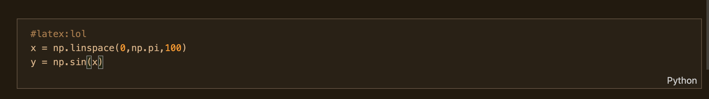
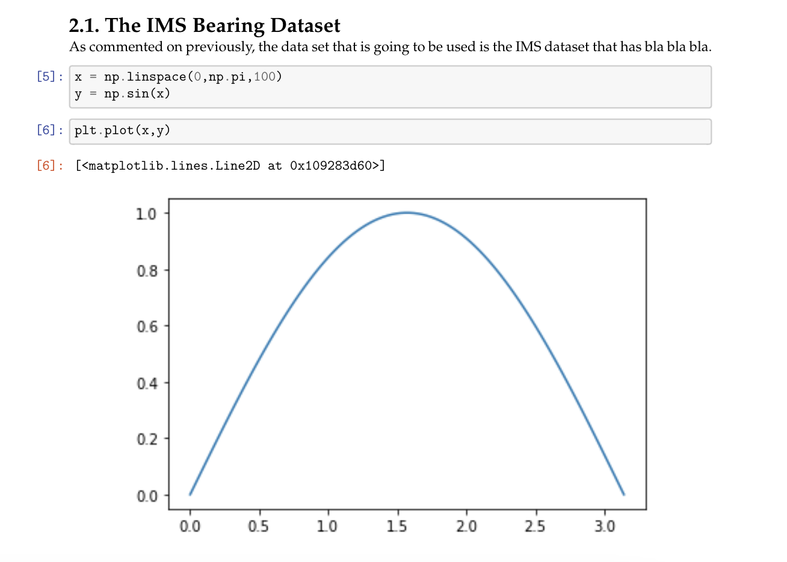

## Jupyter Notebook Cell Extractor
This a little library to extract Jupyter Notebook (.ipynb) cells.  

## Usage
The basics of this programm are described [here](https://stackoverflow.com/questions/55057888/difficult-workflow-writing-latex-book-full-of-python-code) by its original author. This is an adaptation 
The cell extraction works by adding the tag ```#latex:tag_0``` to the cell.  Cells with the same tag will be exported to the same directory. In case there is no tag, the cell wont be exported.  

  

Once the programm is executed, a couple of directorys will be created inside the parent dir. The important one is: ```filtered_cells```. It will create also a ```format.tex``` file which needs to be copyed inside your ```main.tex```. The filtered cells can be copyed and pasted to wherever you need them to be added. The next image show a little example of the exported cells:


There is two way to use the code in this project. The first one if by copying directly the ```main.py``` file inside the src directory and executing the next commands:  
```
python main.py init
python main.py book_name.ipynb
```` 
The second way that it is still in development but it is intended to work by executing the code directly from the Jupyter Lab interface. A possible way would be like this:
```python
from jupyter_cell_extractor.main import *
get_cells(book_name)
````
## Style the cells  
You can use a different style for the cells by changing the ```.tplx``` template. In this library I'm using this [one](https://github.com/t-makaro/nb_pdf_template/blob/master/nb_pdf_template/templates/classic.tplx)
## To do-list 
* Create PyPi library
* Add requirements
* Create tests
* Better the code

Contributions are welcomed!! 

